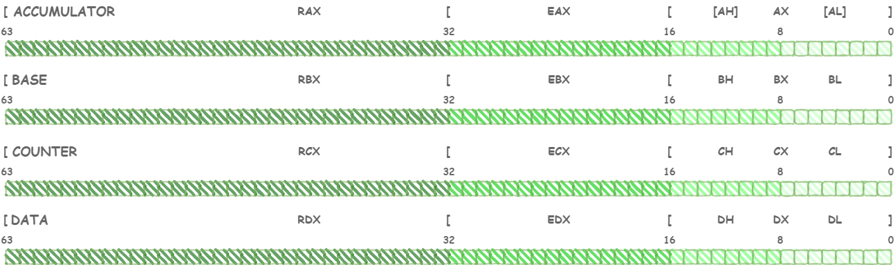

# Assembly
The Netwide Assembler (NASM) is an assembler and disassembler for the Intel x86 architecture. It can be used to write 16-bit, 32-bit (IA-32) and 64-bit (x86-64) programs. NASM is considered to be one of the most popular assemblers for Linux.</br></br>

# Table of contents
* [Architecture of CPU](#architecture-cpu)
  * [Components](#components)
  * [CPU Registers](#cpu-registers)
  * [Instructions Cycle](#instruction-cycle)
* [Introduction to Assembly](#introduction-assembler)
  * [Segments](#segments)
  * [Directives](#directives)
    * [Define Constants](#define-constants)
    * [Define Variables](#define-variables)
    * [Global](#global)
  * [Instructions](#instructions)
  * [Code Example: Hello World](#hello-world)
* [Execute Assembly code](#execute)
  * [Assembling](#assembling)
  * [Linking](#linking)
  * [Running](#running)
* [Memory Segments](#memory-segments)
  * [Data segment](#data-segment)
  * [Code segment](#code-segment)
  * [Stack](#stack)
* [Registers](#registers)
  * [General registers](#general-registers)  
    * [Data registers](#general-registers-data) 
    * [Pointer registers](#general-registers-pointer) 
    * [Index registers](#general-registers-index) 
  * [Control registers](#control-registers)  
  * [Segment registers](#segment-registers)  
* [System Calls](#system-calls)
* [Address Modes](#address-modes)
  * [Register Addressing](#register)   
  * [Immediate Addressing](#immediate)   
  * [Direct Memory Addressing](#direct-memory)   
  * [Direct Offset Addressing](#direct-offset)   
  * [Indirect Offset Addressing](#indirect-offset)   
  * [MOV - Move](#move)  
* [Arithmetic instructions](#arithmetic-instructions)
  * [Increment (INC)](#increment) 
  * [Decrement (DEC)](#decrement)
  * [Addition (ADD)](#addition)
  * [Substraction (SUB)](#substraction)
  * [Multiply (MUL/IMUL)](#multiply)
  * [Divide (DIV/IDIV)](#divide)     
* [Logical instructions](#logical-instructions)
  * [AND](#and)
  * [OR](#or)  
  * [XOR](#xor)  
  * [NOT](#not)  
* [Conditions](#conditions)
  * [Compare (CMP)](#compare)
  * [Unconditial Jump](#unconditial-jump) 
  * [Conditional Jump](#conditial-jump) 
  * [If](#if)
  * [If/Else](#if-else)
  * [Switch](#switch)  
* [Loops](#loops)
  * [While](#while) 
  * [Do-While](#do-while) 
  * [For](#for) 
* [Subroutines](#subroutines)
* [Files](#files)
* [Assembly and C](#assembly-c)
</br>

## Introduction to Assembly <a name="introduction-assembler"></a>
Assembly languages were developed to provide **mnemonics** or symbols for the machine level code instructions. Assembly language programs consist of **mnemonics**, thus they should be translated into machine code. A program that is responsible for this conversion is known as **assembler**.

### Segments <a name="segments"></a>
An **Assembler** program written with **NASM** syntax is formatted for three **sections** or **segments**: ``.data`` for initialize data, ``.bss`` for non initialized data and ``.text`` for actual program code.

 ```assembly
  
  section .data   ;Initialized data
  
  section .bss    ;Non initialized data
  
  section .text   ;Starts the actual program code
  
 ```
 
The ``.bss`` section is not necessary if you initialize all the variables that are declared to the ``.data`` section.</br></br>

### Directives <a name="directives"></a>

Directives are **pseudo-operations** that are only recognized by the assembler. Her function is to **declare certain elements of our program** to be able more easily identified by the programmer and also to facilitate the assembly task.</br></br>

#### Define Constants <a name="define-constants"></a>

A **constant** is a value that cannot be modified by any code statement of the program. The ``equ`` directive is used to define constants, as follows:

 ```
  [constant-name]    equ-directive    value 
 ```
 </br>
 
 Let's see a code example.
 
 ```assembly
 
   section .data         ;Initialized data
   
     msg equ 'Hello'     ;Define constant msg with value 'Hello'
   
   section .text         ;Starts the actual program code
 
 ```
</br>

#### Define Variables <a name="define-variables"></a>

**NASM** provides various **define directives** for **reserving storage space for variables**. The **define** assembler directive is used for allocation of storage space. **It can be used to reserve as well as initialize one or more bytes**.

The syntax for storage allocation statement for initialized data is.

 ```
  [variable-name]    define-directive    initial-value 
 ```
 
Where, variable-name is the identifier for each storage space. The assembler associates an offset value for each variable name defined in the data segment.</br></br>

<div align="center">

  |   Directive   |       Purpose       |     Storage Space      |
  | :-----------: |     :----------:    |     :-----------:      |
  |     DB        |      Define Byte    |   Allocates 1 byte     |
  |     DW        |      Define Word    |   Allocates 2 bytes    |
  |     DD        |   Define Doubleword |   Allocates 4 bytes    |
  |     DQ        |    Define Quadword  |   Allocates 8 bytes    |
  |     DT        |   Define Ten Bytes  |   Allocates 10 bytes   |

</div>
</br>

Let's see a code example.

```assembly
  
  section .data                 ;Initialized data
    
    choice        DB  'y'       ;Allocates 1 byte
    number        DW  12345     ;Allocates 2 bytes
    real_number1  DD  1.234     ;Allocates 4 bytes
    real_number2  DQ  123.456   ;Allocates 8 bytes
  
  section .text                 ;Starts the actual program code
  
 ```
 </br>

#### Global <a name="global"></a>
**Global** directive is **NASM specific**. It is for exporting symbols in your code to where it points in the object code generated. Here you mark `_start` symbol global so its name is added in the object code (a.o). The linker (ld) can read that symbol in the object code and its value so it knows where to mark as an entry point in the output executable. When you run the executable it starts at where marked as `_start` in the code.

If a global directive missing for a symbol, that symbol will not be placed in the object code's export table so linker has no way of knowing about the symbol.

 ```assembly
 
  section .data     ;Initialized data
  
  section .text     ;Starts the actual program code
    
    global _start   ;Must be declared for linker (ld)
    
 ```
</br>

### Instructions <a name="instructions"></a>
As we can se in previous section, an assembly language program is a series of statements, which are either assembly language **instructions** such as ADD and MOV, or statements called **directives**. An **instruction tells the CPU what to do, while a directive (also called pseudo-instructions) gives instruction to the assembler**.
 
 A program language instruction consists of the following four fields. A [ ] indicates that the field is optional.</br>
 
 ```
 [label:]   mnemonics   [operands]    [;comment]
 ```
</br>

The **label field** allows the program to refer to a line of code by name. The label fields cannot exceed a certain number of characters.

 ```assembly
 
  section .data     ;Initialized data
  
  section .text     ;Starts the actual program code
    
    global _start   ;Must be declared for linker (ld)
    
      _start:       ;Tell linker where is the Entry Point of the aplication
    
 ```
 </br>

The **mnemonics** and **operands** together perform the real work of the program and accomplish the tasks. Statements like ``mov rax, 4`` where ``mov`` is the **mnemonic**, wich produce opcodes, and ``rax`` and ``4`` are **operands**. In this case, ``mov rax,4`` is used to move 4 (sys_write) to rax register.
 
 ```assembly
   mov rax,4
 ```
 </br>
 
The **comment field** begins with a semicolon (;) which is a comment indicator. 
 ```assembly
   mov rax,4 ;This is a comment
 ```
</br>

#### Code Example: Hello World <a name="hello-world"></a>
Let's see a **Hello World** code example.

 ```assembly
 
  ;hello-world.asm
  section .data                   ;01: Initialized data

    msg db "Hello World!!",10     ;02: 'Hello world!' plus a linefeed character
    length equ $ - msg            ;03: Length of the 'Hello world!' string

  section .text                   ;04: Starts the actual program code

    global _start                 ;05: Must be declared for linker (ld)

      _start:                     ;06: Tell linker where is the Entry Point of the aplication

        mov rax,4                 ;07: The system call for write (sys_write)
        mov rbx,1                 ;08: File descriptor 1 - standard output

        mov rcx,msg               ;09: Put the offset of hello in rcx
        mov rdx,length            ;10: Put length to rdx

        int 80h                   ;11: Call the kernel (write msg to stdout)

        mov rax,1                 ;12: The system call for exit (sys_exit)
        mov rbx,0                 ;13: Exit with return code of 0 (no error)

        int 80h                   ;14: Call the kernel (exit)
    
 ```
 </br>

## Execute Assembly code <a name="execute"></a>

### Assembling <a name="assembling"></a>

An **assembler** is a program that **generates object code from source code** (assembler code), in our case we will use **Yasm**. **Yasm** is a program that works in line mode and **must be run from a terminal**. To execute it, we use ``yasm`` command, adding the necessary parameters.

Let's see an example of how to convert assembly code into object code:   

<sub>*hello-world.asm*</sub>

```bash

yasm –f elf64 –g dwarf2 hello-world.asm

```
</br>

Once the above command is executed, if no error has occurred, we should get a ``hello-world.o`` file. But, what are the 3 parameters used for?</br></br>

> ``-f elf64``: Parameter to indicate the **format of the object code** it generates; on 64-bit **Linux systems** the format must be **elf64**.

> ``–g dwarf2``: Parameter to **generate information for debugging** of the program; **DWARF2** is a debugging information format that is strongly associated with the **ELF** object code.

> ``hello-world.asm``: Source code. 
</br>

We can check that the file has been generated with the ``ls`` command.

<sub>*ls*</sub>

```console

hello-world.asm  hello-world.o

```
</br>

### Linking <a name="linking"></a>

The **linker** is a program that **generates executable code from the object code** generated by the assembler. The system link is ``ld``, but we will use the ``gcc`` which is internally capable of calling ``ld``. To execute it, we use ``gcc`` command, adding the necessary parameters.

<sub>*hello-world.o*</sub>

```console

gcc -no-pie –o hello-world hello-world.o

```
</br>

Once the above command is executed, if no error has occurred, we should get a ``hello-world`` executable file. But, what are the 3 parameters used for?</br></br>

> ``-no-pie``: We will add the to **avoid problems** in generating the executable when we use an object code .

> ``–o hello-world``: Parameter to **specify the name of the executable code file that is generated**.

> ``hello-world.o``: Object code. 
</br>

We can check that the file has been generated with the ``ls`` command.

<sub>*ls*</sub>

```console

hello-world  hello-world.asm  hello-world.o

```
</br>

### Running <a name="running"></a>

At this point we can run the program with the following command:</br></br>

```console

./hello-world

```
</br>
Once the command is executed we should see the following message.</br></br>

```console

Hello World!!

```
</br>

## Memory Segments <a name="memory-segments"></a>

We have already discussed the **three sections** of an assembly program. **These sections represent various memory segments as well**. A **segmented memory model divides the system memory into groups of independent segments** referenced by pointers located in the segment registers. **Each segment is used to contain a specific type of data**. One segment is used to contain instruction codes, another segment stores the data elements, and a third segment keeps the program stack. </br>

In the light of the above discussion, we can specify various memory segments as: **Data Segment**, **Code Segment** and **Stack**.</br></br>

### Data Segment <a name="data-segment"></a>

It is represented by ``.data`` section and the ``.bss``. The ``.data`` section **is used to declare the memory region**, where data elements are stored for the program. This section cannot be expanded after the data elements are declared, and it remains static throughout the program.

The ``.bss`` section is also a static memory section that contains buffers for data to be declared later in the program. This buffer memory is zero-filled.
</br>

### Code Segment <a name="code-segment"></a>

It is represented by ``.text`` section. This **defines an area in memory that stores the instruction codes**. This is also a fixed area.</br></br>

### Stack <a name="stack"></a>

This segment contains **data values passed to functions and procedures** within the program.</br></br>

## Registers <a name="registers"></a>

Processor operations mostly involve processing data. This data can be stored in memory and accessed from thereon. However, reading data from and storing data into memory slows down the processor, as it involves complicated processes of sending the data request across the control bus and into the memory storage unit and getting the data through the same channel.

To speed up the processor operations, the processor includes some **internal memory storage** locations, called **registers**.</br></br>

### General registers <a name="general-registers"></a>

They are used to store the data with which the operations will be carried out within the program.

#### Data registers <a name="general-registers-data"></a>

Are used for **arithmetic, logical, and other operations**. The **Data registers** are 64-bit *RAX*, *RBX*, *RCX* and *RDX* registers and corresponding 32-bit right portions *EAX*, *EBX*, *ECX* and *EDX*.</br></br>

<p align="center">
  
</p>
</br>

There are **four categories** of data registers:

1. **AX** is the primary **accumulator**: Is used in **input/output and most arithmetic instructions**. For example, in multiplication operation, one operand is stored in EAX or AX or AL register according to the size of the operand.
2. **BX** is the **base** register: As it could be used in **indexed addressing**.
3. **CX** is the **counter** register: As the ECX, CX registers **store the loop count in iterative operations**.
4. **DX** is the **data** register: It is **also used in input/output operations**. It is also used with AX register along with DX for multiply and divide operations involving large values.
</br>

#### Pointer registers <a name="general-registers-pointer"></a>

There are three categories of pointer registers:</br></br>

<p align="center">
  
</p>
</br>

1. **Base Pointer** (BP): This register mainly helps in **referencing the parameter variables passed to a subroutine**.
2. **Stack Pointer** (SP): This register **provides the offset value within the program stack**.
3. **Instruction Pointer** (IP): This register **stores the offset address of the next instruction to be executed**.
</br>

#### Index registers <a name="general-registers-index"></a>

### Control registers <a name="control-registers"></a>

### Segment registers <a name="segment-registers"></a>
